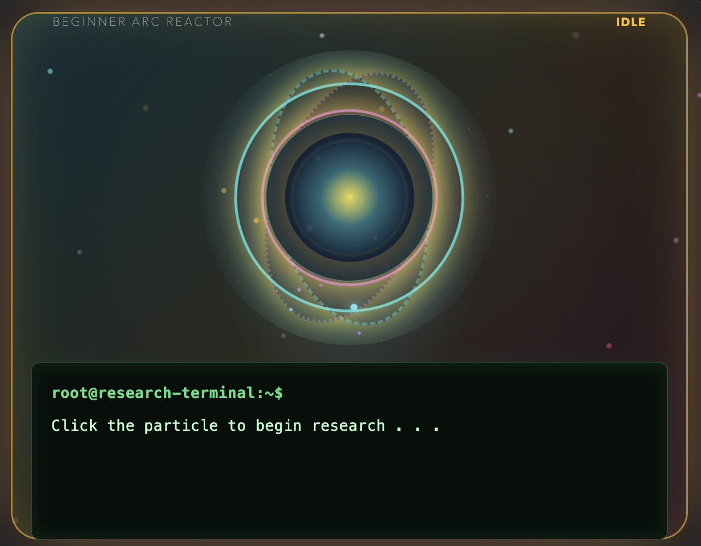

# ParticleRNG

ParticleRNG is an Electron (chromium-based) game about researching particles, collecting increasingly rare materials, and improving a reactor to reach the highest forms of particle research.

## Game Screenshot



## How the game works

1. Open **Research** and click the reactor particle to roll for a reward.
2. Choose a roll count when you have unlocked additional rolls. Higher tiers are rarer, from `1/2` through `1/34359738368`.
3. Check **Inventory** to see collected materials.
4. Use **Crafting** to turn common materials into components, consumables, and utility items.
5. Use **Deconstruct** to break down higher-tier items into randomized lower-tier materials.
6. Buy **Upgrades** to improve luck, roll speed, bulk rolls, jackpot odds, potion duration, and terminal controls.
7. Build reactor modules in **Buildings** to multiply luck. Later buildings require earlier buildings.
8. Configure **Automation** to add robots that roll on your behalf.
9. Use **Usables** such as Luck Potions, Energy Drinks, Chaos Orbs, and Fortune Wax for temporary effects.
10. When the requirements are met, use **Prestige** to reset the current run for permanent bonuses.

The game can also trigger temporary Golden events that provide large luck and roll-count bonuses (based around the "golden cookie" system in cookie clicker). Active effects and event status are shown in the interface.

## Saves

Progress is stored automatically in the browser storage for this Electron app. The **Save Progress** screen provides a manual save action. The game loads the existing save when it starts.

The **Admin Test Panel** is enabled in the current development build. It can grant materials, max upgrades, set roll counts, trigger events, guarantee a tier, and preview animations for testing.


## Requirements

- macOS for building a `.app`
- Node.js and npm
- The project dependencies installed with npm
## Run the game locally

From the project directory:

```bash
npm install
npm start
```

`npm start` launches the Electron window using the root `main.js` process and the web game files in `main/`.

## Load the game in a browser

The browser version uses `main/index.html` as its entry point. For a quick local test on macOS, open it directly:

```bash
open main/index.html
```

You can also open `main/index.html` from Finder or drag it into a browser window. The `style.css`, `script.js`, and `admin.js` files are loaded from the same `main/` folder.

For a local web server, which is useful when testing browser behavior, run this from the project directory:

```bash
python3 -m http.server 8080 --directory main
```

Then visit [http://localhost:8080](http://localhost:8080) in a browser. Stop the server with `Ctrl+C`.

Browser saves use `localStorage` for the local file or localhost origin. They are separate from saves created by the Electron or Android builds.

## Build the macOS app

Run:

```bash
npm run package:mac
```

This uses Electron Packager and creates a `ParticleRNG-darwin-*` app directory inside `releases/`. The PNGTree molecule artwork is compiled as `assets/ParticleRNG.icns` and used as the app icon.

The first packaging run may download `electron-packager` through `npx`. An internet connection is required if that package is not already cached.

The `releases/` directory is ignored by Git so locally built applications are not uploaded to the repository.

## Build the Android APK

After editing files in `main/`, run:

```bash
npm run build:apk
```

This copies the latest game files into `www/`, synchronizes Capacitor, and runs the Android Gradle wrapper. The debug APK is created at:

```text
android/app/build/outputs/apk/debug/app-debug.apk
```

You need Android Studio, the Android SDK, Java, and the Android SDK build tools installed. Android Studio is expected at `/Users/stu57004/Applications/Android Studio.app` for the `npm run open:android` command, but the command-line APK build uses the Gradle wrapper.

## Run and compile in Android Studio

To open the Android project in Android Studio:

```bash
npm run sync:android
npm run open:android
```

In Android Studio:

1. Wait for the Gradle sync and indexing to finish.
2. Select the `app` run configuration.
3. Select an Android emulator or connect an Android device with USB debugging enabled.
4. Click the green **Run** button to install and launch the game.

To create an APK from Android Studio, use:

```text
Build > Build Bundle(s) / APK(s) > Build APK(s)
```

The debug APK is generated at `android/app/build/outputs/apk/debug/app-debug.apk`. For a release build, use **Build > Generate Signed App Bundle or APK**, choose **APK**, and create or select a signing key. Keep signing keys private and use a release key for any APK distributed outside development.

After changing files in `main/`, run `npm run sync:android` before running the project again in Android Studio. The `npm run build:all` command performs this sync automatically and builds both desktop and Android release artifacts.

## Build both apps

To package the macOS app and build the Android APK in one command:

```bash
npm run build:all
```

The macOS app is placed in `releases/`, and the Android debug APK is placed in `android/app/build/outputs/apk/debug/`.

The combined `npm run build:all` command also copies the APK to `releases/ParticleRNG-debug.apk`, alongside the packaged macOS app directory.

## Project files

- `main/index.html` - game interface and views
- `main/style.css` - visual styling and animations
- `main/script.js` - game state, rolls, inventory, crafting, upgrades, and rendering
- `main/admin.js` - development testing controls
- `main.js` - Electron application window
- `assets/ParticleRNG.icns` - macOS application icon
- `old-python/` - previous Python prototypes


---
#### Miscellaneous
---
This game was a python prototype at the start, created during my sophomore high-school year during the spring. It was mainly based around minecraft, but I slowly shifted it into my own style, based all around a sci-fi particle style rng game.


"Thanks to you, K." - baxkz, 2026